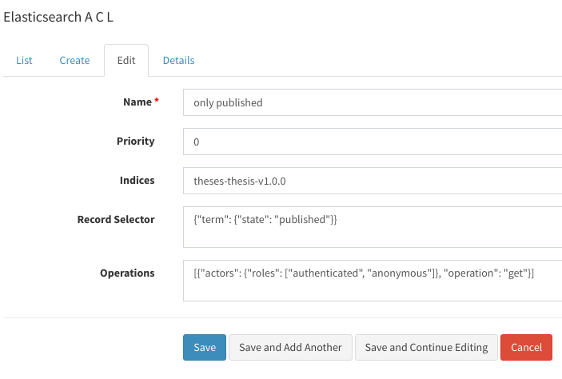

# Declarative ACLs for Invenio v3

## Warning

This is a work in progress. The APIs, data representation, schemas of
indices might change any time.

## Installation

```bash
pip install @oarepo/invenio-acls
invenio db init create
```

## Configuration

A supplemental index is required for each acl-enabled model.
To create it, at first list indices and doctypes and then call `prepare`

```bash

$ invenio invenio-acls list-doctypes

theses-attachment-v1.0.0                 attachment-v1.0.0
theses-thesis-v1.0.0                     thesis-v1.0.0

# prepare <index-name>  <doctype-name>

$ invenio invenio-acls prepare theses-thesis-v1.0.0 thesis-v1.0.0
```

This will create a new index and
will also add a property with pre-parsed ACLs to `theses-thesis-v1.0.0`


## Principles

An ACL rule consists of two parts:

1. Mapping part that defines the set of records the ACL applies to
2. Operation part that defines the actors and allowed operations.

The mapping part is extensible - currently the library contains
two basic implementations. Operation part is currently not extensible
but extension mechanism is planned.

An ACL also contains a priority field. When several ACLs match a given
record, only those with the highest priority are applied. 
This enables exceptions in ACLs. For example:

ACL 1:
* Mapping: "*All records in a repository*", 
* Operation: "*Readable by everyone*" 
* Priority: 0

ACL 2:
* Mapping: "*Records that have a property `secret=true`*", 
* Operation: "visible only to admin"
* Priority: 1
  
When ACLs are applied to a secret record, both ACLs match, but only the second is selected.
 
## Creating ACLs

### Within admin console

The built-in ACLs can be created in the administration console under the ACLs group.


### Mapping part

The library contains two mapping implementations:

#### ID mapping

An ACL that is mapped directly to a single resource identified by UUID


#### Elasticsearch query based mapping

An ACL that is applied to all records that are matched by an elasticsearch query.
Examples:

* to match all records in an index, a query `{"match_all": {}}` can be used
* to match all records in `published` state, use `{"term": {"state": "published"}}` query



### Operation part example

To express that all users in invenio admin role can update resource the operation part would be defined by the following json:

```json
{
  "operation": "update",
  "actors": {
    "roles": ["admin"]
  }
}
```

## Filtering elasticsearch results on REST api

To filter ES results by effective ACLs, use `ACLRecordsSearch`
instead of `RecordsSearch`. Also use `acl_*_permission_factory` 
to allow "get", "update", "delete" acl-based operations:

```python
from invenio_acls import ACLRecordsSearch, \
                         acl_read_permission_factory, \
                         acl_update_permission_factory, \ 
                         acl_delete_permission_factory

REST_ENDPOINTS = {

    'thesis': dict(
        # ...

        # search class
        search_class=ACLRecordsSearch,

        # ACL based permissions
        create_permission_factory_imp=...,
        read_permission_factory_imp=acl_read_permission_factory,
        update_permission_factory_imp=acl_update_permission_factory,
        delete_permission_factory_imp=acl_delete_permission_factory,
        # ...
    ),
}
```

# Programmatic access to the library

## Instantiating builtin ACLs

```python
from invenio_acls.id_acls import IdAcl
from invenio_acls.proxies import current_acls

idacl = IdACL(
  name="My first ACL",
  priority=0,
  indices=["theses-thesis-v1.0.0"],
  record_id = '<uuid>',
  database_operations = [
    {"operation": "get", "actors": {"roles": ["authenticated"]}}
  ],
  originator = current_user,
)
db.session.add(idacl)
db.session.commit()

# save the ACL to supplementary index and enrich all matching records
# with ACL mapping

current_acls.index_acl(idacl)

```

## Creating custom ACLs

### ACL database mixin and handlers

A custom implementation of ACL rule consists of two classes: database
(or database-like) ACL object and a handler for ACL application.

TBD.
